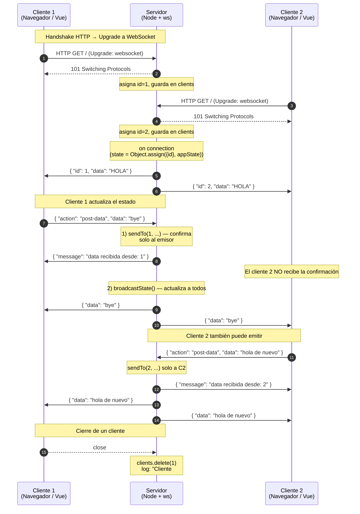

# Websockets Nativos Hola

Proyecto de estudio para aprender y experimentar con **WebSockets nativos** en Node.js, sin librerías de abstracción como Socket.IO. Usa `ws` en el backend y la API nativa `WebSocket` del navegador en el frontend (Vue 3).

La idea es mantener un pequeño **estado compartido en el servidor** que se sincroniza en tiempo real con todos los clientes conectados: cualquier mensaje enviado por un cliente se retransmite automáticamente a los demás.

Además, cada cliente recibe un **id numérico incremental** al conectarse, se registra en un `Map` en el servidor y queda disponible para enviarle mensajes individuales con el helper `sendTo()`.

## Stack

- **Backend:** Node.js + Express 5 + `ws` (WebSocket nativo)
- **Frontend:** Vue 3 (vía CDN) + `matcha.css`
- **Otros:** `cors`, `nodemon` (dev)

## Estructura

```
.
├── server.js          # Servidor HTTP + WebSocket
├── public/
│   ├── index.html     # Cliente Vue 3 con WebSocket nativo
│   └── page2.html     # Segunda página de prueba
├── package.json
└── README.md
```

## Instalación

```bash
npm install
```

## Ejecución

```bash
# Modo desarrollo (con nodemon, recarga automática)
npm run dev

# Modo producción
npm start
```

Por defecto el servidor escucha en `http://localhost:3000`.

Abre varias pestañas en `http://localhost:3000` para ver cómo el estado se sincroniza en tiempo real entre ellas.

## Cómo funciona

### Estado en memoria

El servidor guarda un único objeto en memoria y un registro de clientes:

```js
let appState = { data: 'HOLA' };

let nextClientId = 1;
const clients = new Map(); // id -> ws
```

`clients` mapea el `id` incremental de cada conexión a su instancia `ws`, y se usa para enviar mensajes uno-a-uno.

### Endpoints HTTP (legado / debug)

- `GET  /api/get-data`   → devuelve el estado actual.
- `POST /api/post-data`  → actualiza `data` y dispara un `broadcast` por WebSocket.

### WebSocket nativo

El servidor levanta un `WebSocketServer` sobre el mismo servidor HTTP (`server.js:27`). Al conectarse un cliente:

1. Se le asigna un `id` incremental (`server.js:50`), se guarda en `clients` y se loguea como `Cliente conectado vía WebSocket Nativo: N` (`server.js:53`).
2. Recibe inmediatamente el estado actual **incluyendo su id**, fusionando `{ id }` con `appState` (`server.js:56-57`).
3. Puede enviar mensajes JSON con la forma `{ "action": "post-data", "data": "..." }` para actualizar el estado. Cada mensaje recibido se loguea con el id del cliente (`server.js:63`).
4. Tras un `post-data` el servidor le envía **solo a ese cliente** una confirmación uno-a-uno con `sendTo` (`server.js:66`) y luego hace `broadcastState()` a todos (`server.js:68`).
5. El broadcast sigue mandando `appState` puro (sin id) a todos los abiertos (`server.js:30-38`).
6. Al desconectarse se elimina del `Map` y se loguea como `Cliente #N desconectado` (`server.js:75-78`).

### Mensajes uno-a-uno con `sendTo`

El helper `sendTo(id, payload)` (`server.js:40-46`) permite enviarle un mensaje a un cliente puntual por su id, sin tocar al resto:

```js
sendTo(1, { type: 'ping', msg: 'hola cliente 1' });
```

Si el id no existe o el socket ya no está abierto, simplemente no hace nada.

En este proyecto se usa concretamente en el handler de `post-data` para confirmar la recepción al cliente que escribió:

```js
sendTo(id, { message: `data recibida desde: ${ id }` });
```

### Cliente

`public/index.html` abre una conexión con `new WebSocket(\`ws://${window.location.host}\`)` (`public/index.html:49`) y:

- Lee su propio `id` del primer mensaje que recibe (`response.id`) y lo muestra en el título: `Websockets Nativos Hola [<id>]` (`public/index.html:14,55`).
- Reacciona a `onmessage` actualizando la vista y el input.
- Reintenta la conexión cada 2 s ante `onclose`.
- Envía datos con `socket.send(JSON.stringify({ action: 'post-data', data }))`.

## Diagrama de secuencia

Flujo típico con dos clientes conectados. El primero actualiza el estado y el servidor lo retransmite a todos.



Como referencia, el flujo por HTTP sigue el mismo principio: `POST /api/post-data` también dispara el `broadcast` a todos los sockets abiertos.

## Mensajes

### Cliente → Servidor

```json
{ "action": "post-data", "data": "texto a guardar" }
```

### Servidor → Cliente (al conectarse, uno-a-uno)

Es el primer mensaje que recibe cada cliente. Incluye su propio `id` fusionado con el estado:

```json
{ "id": 1, "data": "HOLA" }
```

### Servidor → Clientes (broadcast)

Tras un `post-data` (vía socket o vía `POST /api/post-data`), se reenvía `appState` a todos los sockets abiertos:

```json
{ "data": "texto actual" }
```

### Servidor → Cliente (confirmación uno-a-uno tras `post-data`)

Después de aplicar el cambio, el servidor le envía **solo al emisor** una confirmación vía `sendTo`:

```json
{ "message": "data recibida desde: 1" }
```

## Notas

- El estado y el `Map` de clientes viven **solo en memoria**: si reinicias el servidor se pierden. El contador `nextClientId` también se reinicia, así que los ids pueden repetirse entre ejecuciones.
- No hay autenticación ni salas: todos los clientes comparten el mismo estado.
- El proyecto es deliberadamente simple; es una base para experimentar.
