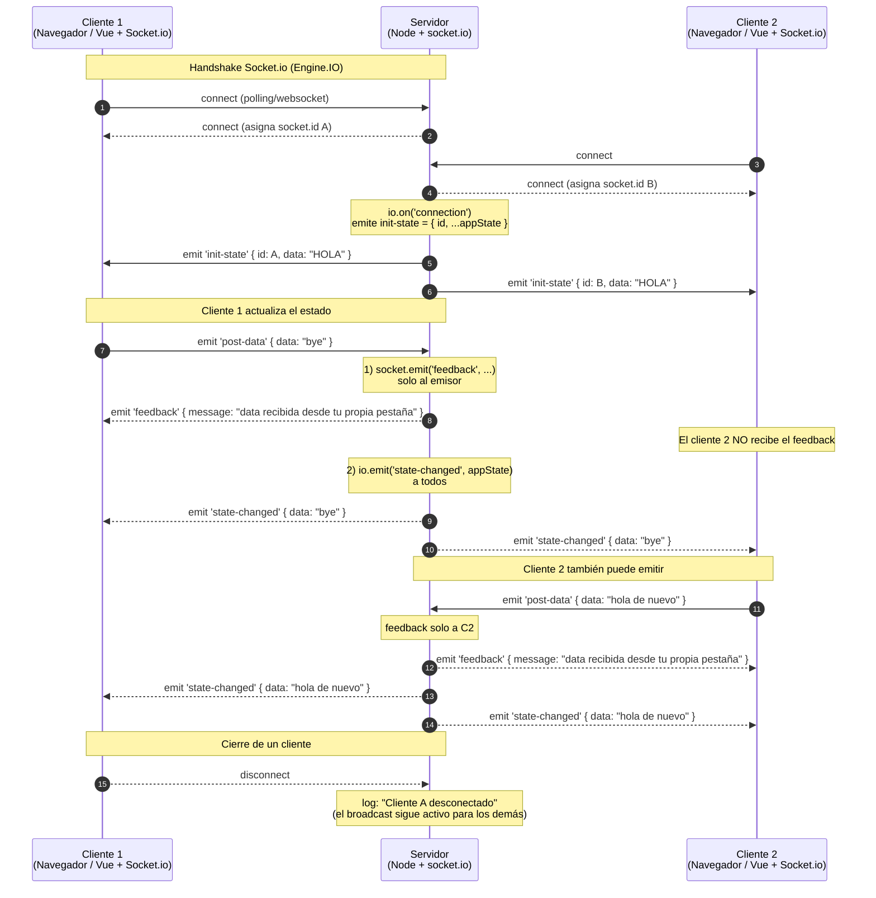

# Socket.io Hola

Proyecto de estudio para aprender y experimentar con **Socket.io** sobre Node.js. Usa Socket.io tanto en el backend (`socket.io`) como en el frontend (cliente servido por el propio Socket.io desde `/socket.io/socket.io.js`), con Vue 3 (vía CDN) como capa de UI.

La idea es mantener un pequeño **estado compartido en el servidor** que se sincroniza en tiempo real con todos los clientes conectados: cualquier mensaje enviado por un cliente se retransmite automáticamente a los demás.

Además, Socket.io asigna automáticamente un **`socket.id` alfanumérico único** a cada conexión, lo que el cliente muestra en pantalla y el servidor usa para responderle mensajes uno-a-uno sin tocar al resto.

## Stack

- **Backend:** Node.js + Express 5 + `socket.io`
- **Frontend:** Vue 3 (vía CDN) + cliente de Socket.io (vía `<script src="/socket.io/socket.io.js">`) + `matcha.css`
- **Otros:** `cors`, `nodemon` (dev)

## Estructura

```
.
├── server.js          # Servidor HTTP + Socket.io
├── public/
│   ├── index.html     # Cliente Vue 3 con Socket.io
│   └── page2.html     # Segunda página de prueba (placeholder)
├── package.json
└── README.md
```

## Instalación

```bash
npm install
```

## Ejecución

```bash
# Modo desarrollo (con nodemon, recarga automática)
npm run dev

# Modo producción
npm start
```

Por defecto el servidor escucha en `http://localhost:3000`. Socket.io se monta sobre el mismo servidor HTTP y expone su cliente en `http://localhost:3000/socket.io/socket.io.js`, que `index.html` carga directamente con un `<script>`.

Abre varias pestañas en `http://localhost:3000` para ver cómo el estado se sincroniza en tiempo real entre ellas. Cada pestaña recibirá su propio `socket.id` (por ejemplo `AbCdEf123456...`).

## Cómo funciona

### Estado en memoria

El servidor guarda un único objeto en memoria:

```js
let appState = {
    data: 'HOLA', // estado inicial
};
```

Socket.io se encarga de gestionar el conjunto de conexiones activas; no hace falta mantener un `Map` manual de clientes.

### Endpoints HTTP (legado / debug)

- `GET  /api/get-data`   → devuelve el estado actual (`server.js:68-70`).
- `POST /api/post-data`  → actualiza `data`, dispara el `broadcastState()` a todos los sockets y responde con el nuevo estado (`server.js:72-76`).

### Socket.io

El servidor levanta Socket.io sobre el mismo servidor HTTP (`server.js:23-25`). Al conectarse un cliente:

1. Se loguea como `Cliente conectado vía Socket.io: <socket.id>` (`server.js:43`). El `socket.id` es un identificador **alfanumérico** que Socket.io genera solo.
2. El servidor le emite **solo a esa conexión** el evento `init-state` con `{ id: socket.id, ...appState }` (`server.js:47`).
3. El cliente puede emitir el evento `post-data` con `{ data: '...' }` para actualizar el estado (`server.js:50-60`). El servidor loguea el payload recibido con el `socket.id` del emisor (`server.js:51`).
4. Tras un `post-data` el servidor le envía **solo al emisor** el evento `feedback` con un mensaje uno-a-uno (`server.js:56`) y luego emite a **todos** el evento `state-changed` con el nuevo `appState` (`server.js:59`).
5. Al desconectarse se loguea como `Cliente <socket.id> desconectado` (`server.js:63`).

### Mensajes uno-a-uno con `socket.emit` y `sendTo`

Dentro de un handler de `io.on('connection', (socket) => { ... })` lo más cómodo es responderle al emisor con `socket.emit(eventName, payload)` (ver `server.js:41-65`). El resto de clientes no recibe ese mensaje.

Si necesitás enviarle un mensaje a un cliente puntual desde fuera del handler (por ejemplo, desde una ruta HTTP o un temporizador), usá el helper `sendTo(id, eventName, ...args)` (`server.js:33-36`), que envuelve `io.to(id).emit(...)`:

```js
sendTo('AbCdEf123456...', 'feedback', { message: 'hola cliente A' });
```

Si el `socket.id` no corresponde a ninguna conexión activa, Socket.io lo descarta silenciosamente.

### Helpers `broadcastState` y `sendTo`

- `broadcastState()` (`server.js:28-30`) emite el evento `state-changed` con `appState` a todos los clientes conectados vía `io.emit(...)`. Hoy lo usa el handler de `POST /api/post-data` (`server.js:74`) para mantener sincronizadas las pestañas incluso cuando la actualización llega por HTTP en vez de por socket.
- `sendTo(id, eventName, ...args)` (`server.js:33-36`) hace `io.to(id).emit(eventName, ...args)`, útil para responderle a un cliente puntual por su `socket.id` desde fuera del handler de `connection`.

### Cliente

`public/index.html` abre la conexión con `io()` (sin argumentos, se autoconecta al host que sirve la página) (`public/index.html:50`) y:

- Lee su propio `id` del evento `init-state` (`response.id`) y lo muestra en el título `Sockert.io Hola [<id>]` (`public/index.html:15,55`).
- Reacciona al evento `state-changed` actualizando la vista y el input (`public/index.html:61-65`).
- Guarda en `serverFeedback` el mensaje recibido por `feedback` (`public/index.html:68-70`).
- Loguea la desconexión si la conexión se cae (`public/index.html:73-75`). Socket.io gestiona la reconexión automáticamente, por lo que no hace falta reintentar manualmente.
- Envía datos con `socket.emit('post-data', { data })` (`public/index.html:87`).

## Diagrama de secuencia

Flujo típico con dos clientes conectados. El primero actualiza el estado y el servidor lo retransmite a todos.



Como referencia, el flujo por HTTP sigue existiendo: `POST /api/post-data` actualiza el estado en el servidor y dispara el mismo `broadcastState()` (evento `state-changed`) que dispara `post-data` por socket, así que ambas rutas terminan propagando el cambio a todos los clientes conectados (`server.js:74`).

## Eventos

A diferencia de `ws` nativo, Socket.io trabaja con **eventos con nombre** en vez de un único canal JSON con un campo `action`. La serialización/deserialización la hace la librería.

### Cliente → Servidor

| Evento       | Payload                  | Efecto en el servidor                                   |
| ------------ | ------------------------ | ------------------------------------------------------- |
| `post-data`  | `{ data: string }`       | Actualiza `appState.data` y emite `feedback` + `state-changed`. |

### Servidor → Cliente (al conectarse, uno-a-uno)

Es el primer mensaje que recibe cada cliente. Incluye su propio `socket.id` fusionado con el estado:

```json
{ "id": "AbCdEf123456...", "data": "HOLA" }
```

### Servidor → Clientes (broadcast)

Tras un `post-data`, se emite a **todos** el evento `state-changed` con `appState`:

```json
{ "data": "texto actual" }
```

### Servidor → Cliente (confirmación uno-a-uno tras `post-data`)

Después de aplicar el cambio, el servidor le envía **solo al emisor** el evento `feedback`:

```json
{ "message": "data recibida desde tu propia pestaña" }
```

## Notas

- El estado vive **solo en memoria**: si reinicias el servidor se pierde. Los `socket.id`, en cambio, son aleatorios por conexión, así que no se conservan entre sesiones (lo cual está bien: cada nueva conexión obtiene un id nuevo).
- No hay autenticación ni salas: todos los clientes comparten el mismo estado.
- Socket.io gestiona la **reconexión automática** en el cliente, así que ante caídas de red se restablece sola sin necesidad de `setTimeout` manual.
- `POST /api/post-data` reusa `broadcastState()` para emitir el mismo evento `state-changed` que dispara el handler de `post-data` por socket, manteniendo una única fuente de broadcast.
- Para responderle a un cliente puntual por `socket.id` desde fuera del handler de `connection` (p. ej. desde una ruta HTTP), usá `sendTo(id, eventName, ...args)` (`server.js:33-36`).
- El proyecto es deliberadamente simple; es una base para experimentar.
