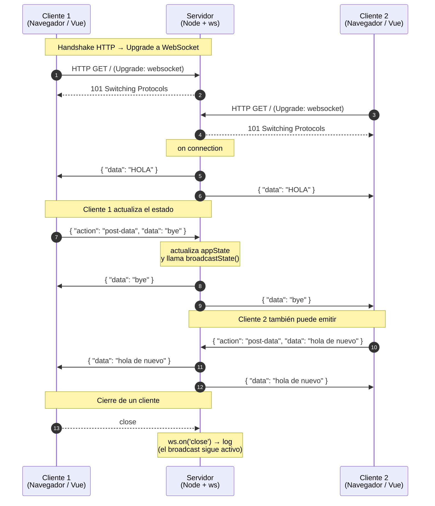

# Websockets Nativos Hola

Proyecto de estudio para aprender y experimentar con **WebSockets nativos** en Node.js, sin librerías de abstracción como Socket.IO. Usa `ws` en el backend y la API nativa `WebSocket` del navegador en el frontend (Vue 3).

La idea es mantener un pequeño **estado compartido en el servidor** que se sincroniza en tiempo real con todos los clientes conectados: cualquier mensaje enviado por un cliente se retransmite automáticamente a los demás.

## Stack

- **Backend:** Node.js + Express 5 + `ws` (WebSocket nativo)
- **Frontend:** Vue 3 (vía CDN) + `matcha.css`
- **Otros:** `cors`, `nodemon` (dev)

## Estructura

```
.
├── server.js          # Servidor HTTP + WebSocket
├── public/
│   ├── index.html     # Cliente Vue 3 con WebSocket nativo
│   └── page2.html     # Segunda página de prueba
├── package.json
└── README.md
```

## Instalación

```bash
npm install
```

## Ejecución

```bash
# Modo desarrollo (con nodemon, recarga automática)
npm run dev

# Modo producción
npm start
```

Por defecto el servidor escucha en `http://localhost:3000`.

Abre varias pestañas en `http://localhost:3000` para ver cómo el estado se sincroniza en tiempo real entre ellas.

## Cómo funciona

### Estado en memoria

El servidor guarda un único objeto en memoria:

```js
let appState = { data: 'HOLA' };
```

### Endpoints HTTP (legado / debug)

- `GET  /api/get-data`   → devuelve el estado actual.
- `POST /api/post-data`  → actualiza `data` y dispara un `broadcast` por WebSocket.

### WebSocket nativo

El servidor levanta un `WebSocketServer` sobre el mismo servidor HTTP (`server.js:23`). Al conectarse un cliente:

1. Recibe inmediatamente el estado actual (`server.js:41`).
2. Puede enviar mensajes JSON con la forma `{ "action": "post-data", "data": "..." }` para actualizar el estado (`server.js:44-55`).
3. Cualquier cambio se retransmite a **todos** los clientes conectados vía `broadcastState` (`server.js:26-34`).

### Cliente

`public/index.html` abre una conexión con `new WebSocket(\`ws://${window.location.host}\`)` (`public/index.html:48`) y:

- Reacciona a `onmessage` actualizando la vista y el input.
- Reintenta la conexión cada 2 s ante `onclose`.
- Envía datos con `socket.send(JSON.stringify({ action: 'post-data', data }))`.

## Diagrama de secuencia

Flujo típico con dos clientes conectados. El primero actualiza el estado y el servidor lo retransmite a todos.



Como referencia, el flujo por HTTP sigue el mismo principio: `POST /api/post-data` también dispara el `broadcast` a todos los sockets abiertos.

## Mensajes

### Cliente → Servidor

```json
{ "action": "post-data", "data": "texto a guardar" }
```

### Servidor → Clientes (broadcast)

```json
{ "data": "texto actual" }
```

## Notas

- El estado vive **solo en memoria**: si reinicias el servidor se pierde.
- No hay autenticación ni salas: todos los clientes comparten el mismo estado.
- El proyecto es deliberadamente simple; es una base para experimentar.
