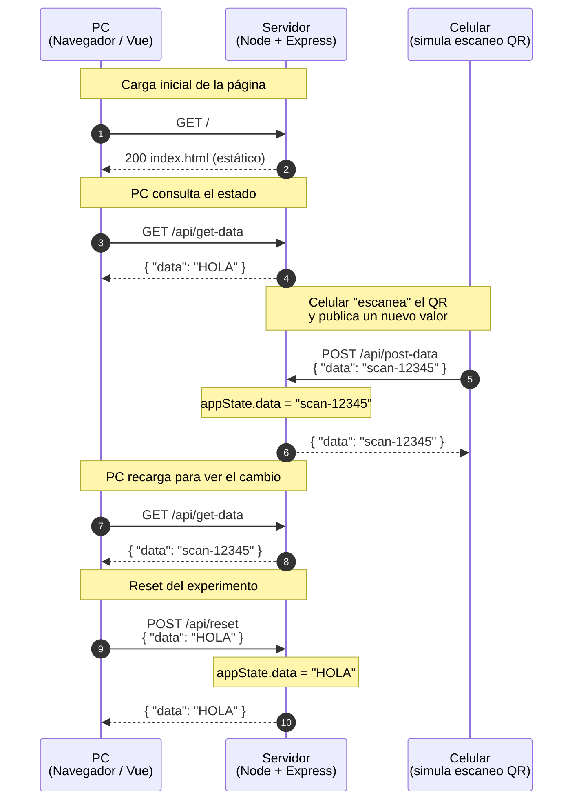

# Websockets Hola

Proyecto de estudio para experimentar con la comunicación **cliente ↔ servidor**. Esta rama (`01-client-server`) es el primer paso: solo HTTP, sin WebSockets. La idea es sentar las bases de un flujo tipo "redirección por QR" — un cliente (PC) consulta el estado y otro (celular, simulando el escaneo de un QR) lo actualiza.

## Stack

- **Backend:** Node.js + Express 5
- **Frontend:** Vue 3 (vía CDN) + `matcha.css`
- **Otros:** `cors`, `nodemon` (dev)

## Estructura

```
.
├── server.js          # Servidor HTTP (Express)
├── public/
│   ├── index.html     # Cliente Vue 3 con botones GET / POST
│   └── page2.html     # Segunda página de prueba
├── package.json
└── README.md
```

## Instalación

```bash
npm install
```

## Ejecución

```bash
# Modo desarrollo (con nodemon, recarga automática)
npm run dev

# Modo producción
npm start
```

Por defecto el servidor escucha en `http://localhost:3000`.

## Cómo funciona

### Estado en memoria

El servidor guarda un único objeto en memoria que persiste entre requests:

```js
let appState = { data: 'HOLA' };
```

Se modifica únicamente cuando alguien hace `POST /api/post-data` o `POST /api/reset`.

### Endpoints HTTP

Definidos en `server.js:18-32`:

| Método | Ruta | Body | Efecto | Respuesta |
|---|---|---|---|---|
| `GET`  | `/api/get-data`  | — | Lee el estado actual | `appState` |
| `POST` | `/api/post-data` | `{ "data": "..." }` | Reemplaza `appState.data` con el valor enviado (o `'-'` si falta) | `appState` |
| `POST` | `/api/reset`     | `{ "data": "..." }` | Reemplaza `appState.data` con el valor enviado (o `''` si falta) | `appState` |

También se sirve el contenido estático de `public/` (Express static), así que `index.html` y `page2.html` están disponibles en `http://localhost:3000/` y `http://localhost:3000/page2.html`.

### Cliente

`public/index.html` es una mini app Vue 3 con dos acciones:

- **GET** (`index.html:44-58`): hace `fetch('/api/get-data')` y vuelca la respuesta en `<pre>` y en el input.
- **POST** (`index.html:60-81`): arma `{ data: inputData.value }` y hace `fetch('/api/post-data', { method: 'POST', body: JSON.stringify(...) })`.
- Link a `page2.html` en otra pestaña (`index.html:27`).

> Importante: como todavía **no hay WebSockets**, los cambios que haga un cliente no se propagan automáticamente a las pestañas abiertas. Cada pestaña tiene que volver a hacer `GET` para ver el estado actualizado.

`public/page2.html` es solo un placeholder con un `ref` que muestra `Hello!`, sin llamadas al backend.

## Diagrama de secuencia

Flujo típico del experimento: la **PC** abre la página, el **celular** (o la propia PC en otra pestaña) simula el escaneo del QR y actualiza el estado, y la PC lo vuelve a leer.



## Mensajes

### `GET /api/get-data`

Sin body. Respuesta:

```json
{ "data": "HOLA" }
```

### `POST /api/post-data`

Request:

```json
{ "data": "scan-12345" }
```

Respuesta:

```json
{ "data": "scan-12345" }
```

### `POST /api/reset`

Request:

```json
{ "data": "HOLA" }
```

Respuesta:

```json
{ "data": "HOLA" }
```

## Notas

- Esta rama es **solo HTTP**. No hay WebSockets, ni broadcast, ni push al cliente: cada pestaña tiene que volver a pedir el estado para enterarse de un cambio.
- El estado vive **solo en memoria**: si reiniciás el servidor, vuelve a `HOLA`.
- El nombre de la rama (`01-client-server`) sugiere que es la primera etapa; seguramente la siguiente introduce WebSockets para que el servidor empuje los cambios al cliente sin necesidad de recargar.
